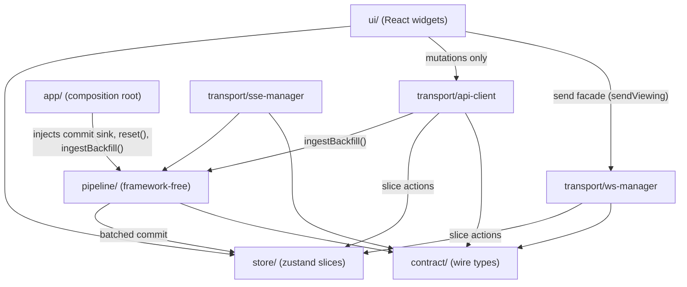
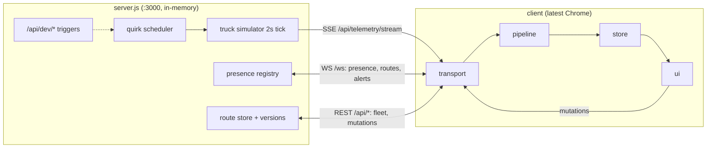
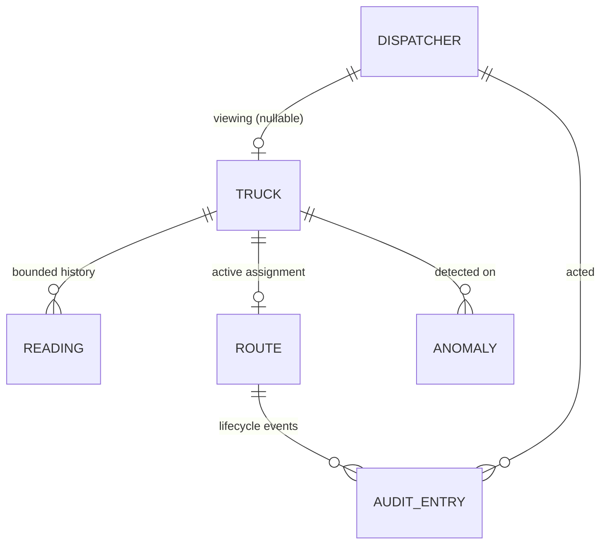

# Architecture Spine — FleetPulse

## Design Paradigm

**Layered unidirectional dataflow** on the client, with the telemetry integrity engine as a **pipes-and-filters** core. Four layers map one-to-one onto `src/` directories: `transport/` (sockets + HTTP only) → `pipeline/` (framework-free filters) → `store/` (single Zustand source of truth) → `ui/` (React, render-only). The server is a **single-process simulator** (`server.js`) sharing one constants module with the client. React exists only in `ui/` and `app/`; the pipeline and store import no React and no DOM.

## Invariants & Rules

### AD-1 — Dependency direction is one-way, transport→pipeline→store←ui

- **Binds:** all client code (G2, NFR-9)
- **Prevents:** UI reaching into sockets; pipeline coupled to rendering; two data paths into state
- **Rule:** the arrows below are the only legal dependency directions. `ui/` may import `store/` (selectors/actions), `transport/api-client` (mutations), and the WS manager's typed **send-only facade** (`sendViewing`) — nothing else from transport, never `pipeline/`. `pipeline/` modules import only `contract/` and `shared/constants.js`; their store commit sink, `reset()`, and `ingestBackfill()` seams are injected by `app/` (the composition root), which alone bridges lifecycle events into the pipeline. The connection managers and `api-client` call store slice actions directly. Subscribing transport to the store as a covert command channel is forbidden. Only SSE telemetry and history backfill traverse `pipeline/`; WS coordination events (presence, routes, alerts) are parsed against `contract/` in the WS manager and dispatched to slice actions. Everything may import `shared/constants.js`.



### AD-2 — One constants module rules every tunable `[ADOPTED — PRD OQ-3]`

- **Binds:** server.js, client, tests (all 8 failure modes, PRD §5 constants table)
- **Prevents:** server emission parameters drifting from the client thresholds that classify them; tests freezing divergent copies
- **Rule:** `shared/constants.js` (plain ESM object literals, `package.json` `type: module`) is the only place any tunable exists — server emission parameters (2 s cadence, 10–30 batch, 2–4 s fuel glitch, `truck_7` stuck at 999 km/h for 5–10 s, ghost disconnect 20% chance with a fixed 10 s delay — the client still tolerates *up to* 10 s per FR-19, fleet 503 15% chance + `Retry-After`) and every client threshold. Where the brief fixes a value, the constant is the brief's; only free parameters (start positions, in-range distributions) are build-time choices, made inside the same module. `server.js`, client code, and tests import it; a tunable literal anywhere else is a defect.

### AD-3 — Trust is assigned in the pipeline, nowhere else

- **Binds:** FR-5..FR-9, FR-20, every widget that shows a value
- **Prevents:** widgets re-implementing plausibility logic; raw stream values leaking to the UI; stale/degraded derived differently per widget so the five states stop being exactly-one
- **Rule:** every value crossing the pipeline boundary is a `Reading<T>` envelope `{value, trust, readingTs, arrivalTs}` — **one envelope per signal** (speed, fuel, temperature, position each carry their own trust; FR-20). Pipeline filters alone assign plausibility trust (trusted / suspect / sensor-fault); **one store selector** derives effective trust by layering stale (per-truck arrival clock) and degraded (health slice) on top — the only trust source widgets read, so a value is always in exactly one of the five PRD states, rendered via the one shared `TrustBadge` component. Every parsed reading, accepted or rejected, refreshes the truck's arrival clock: staleness means silence, not rejection. One constants-defined staleness tick, started by `app/`, re-evaluates the selector — widgets never own timers. A classifier that cannot decide resolves toward alerting, never suppression (CM1) — binding on every registered rule (AD-6). Raw rejected values exist only inside anomaly-log entries (AD-18).

### AD-4 — Pipeline stage order and the two-clock rule

- **Binds:** FR-3, FR-4, FR-6, FR-7, FR-8, NFR-1, NFR-2
- **Prevents:** classification running on unordered readings (a stale 0% reopening a suspect window); staleness and suspect windows computed against different clocks per builder
- **Rule:** fixed filter order per truck: ingest (parse contract message) → order/dedupe by reading timestamp (older-than-current backfills history, never overwrites state) → classify (registered rules) → one batched store commit. Backfills bypass state update and window bookkeeping but **still pass classification** in stateless mode (plausibility rules only, no window mutation), so every history entry carries real trust and its anomalies are logged. Reading timestamps drive ordering and suspect windows; the arrival clock drives staleness only.

### AD-5 — Single store, single batched commit path

- **Binds:** all client state (NFR-1, FR-1, FR-3)
- **Prevents:** component-local mirrors of fleet state; render storms under SSE floods
- **Rule:** the Zustand store is the only client source of truth. All pipeline output lands through one coalescing commit (ceiling from `shared/constants.js`, ≤10 commits/s); `dispatcher_viewing` churn rides the same scheduler; other WS events (route, join/leave, alert) commit directly — low-rate by contract. The NFR-1 flood test counts coalesced commits. Components subscribe via selectors; no `useState` copies of fleet/route/presence data.

### AD-6 — Extensibility is registration at three seams

- **Binds:** NFR-9, G2, FR-28
- **Prevents:** switch-statement growth; "add a sensor" turning into edits across existing modules
- **Rule:** three registries — telemetry **signals** (field + format/render meta), **anomaly rules** (classifier functions the pipeline folds over), **widgets** (panels the shell mounts inside per-widget error boundaries). Adding one = new module + one `register*` call; editing an existing module to accommodate it is a violation. The README tire-pressure example walks exactly these seams.

### AD-7 — One mutation gate, one conflict flow `[ADOPTED — FR-12/FR-13]`

- **Binds:** FR-10..FR-15, FR-31, FR-34, NFR-4..NFR-7
- **Prevents:** ad-hoc `fetch` calls skipping headers; two different 409 experiences
- **Rule:** every HTTP mutation flows through `transport/api-client`, which injects `X-Dispatcher-Id` on all mutations and `If-Match` on version-bearing route mutations (PATCH `/api/routes/:routeId`, PUT `/api/routes/:routeId/reassign`; POST create carries no version — FR-34's warn-and-confirm covers that seam), enforces pessimistic UI (in-flight indicator; state changes only on 2xx), and routes **every** 409 — stale version or mid-processing race — into the single FR-13 side-by-side conflict flow fed by the 409 body (conflicting dispatcher + current server state). `api-client` reads `dispatcherId` live from the session field (AD-17) and refuses mutations with a visible reason while unregistered (FR-16). No component calls `fetch` directly.

### AD-8 — Connection lifecycle has exactly two owners

- **Binds:** FR-16..FR-19, FR-24, FR-25, FR-27
- **Prevents:** duplicate EventSource/WebSocket instances; presence keyed by name in one widget and id in another
- **Rule:** one SSE manager and one WS manager own connect/reconnect/backoff (1 s doubling to 15 s cap); the WS manager re-registers and rebuilds presence on reconnect, sends `ping` at the constants-defined keepalive interval, and consumes `pong` (ping/pong RTT is FR-30's latency metric). Unknown WS message types are dropped safely and counted in obs (FR-33); `fleet_reset` triggers the one three-step reset sequence owned by `app/`: (1) `pipeline.reset()` — drop the pending coalesce buffer, per-truck cursors, dedupe sets, and open suspect windows; (2) the store-wide reset action — wipe fleet, routes, presence cache, anomaly log, and history (obs counters and the session field survive); (3) refetch, probing immediately if the breaker is open. Presence is keyed by server-issued `dispatcherId` only; FR-19's ghost rules live in the presence slice; the client's own identity is session state, not presence (AD-17). Pre-breaker, `api-client` auto-retries the fleet GET per `Retry-After` (FR-24); the circuit breaker sits inside `api-client` (3×503 opens; probe every max(10 s, `Retry-After`)). Nothing else opens a connection, retries, or interprets WS messages.

### AD-9 — Degraded mode is owned by the health slice

- **Binds:** FR-26, FR-25, FR-4, CM2
- **Prevents:** widgets inferring their own "we're degraded" logic; banner flapping
- **Rule:** the store's health slice holds named conditions (`telemetryStreamDown`, `fleetFetchFailing`), each set only by its transport/breaker owner, each cleared with the 5 s hysteresis. The banner is a pure rendering of the slice; per-truck age badges come from the effective-trust selector (AD-3), not from health conditions. No widget sets or derives degraded state.

### AD-10 — Every collection goes through boundedBuffer

- **Binds:** NFR-3 (telemetry history, anomaly log, audit trail, obs counters)
- **Prevents:** one unbounded array defeating the 8-hour-shift memory claim
- **Rule:** all in-memory collections are created via the one `boundedBuffer` utility, capped at insertion with caps from `shared/constants.js`. `boundedBuffer` takes an optional ordering key: history buffers order by `readingTs` and evict from the timestamp-oldest end — sorted insertion happens once, at commit, never at render. An uncapped collection is a review defect.

### AD-11 — Contract fidelity, dev hooks quarantined `[ADOPTED — PRD §6; OQ-6 resolved]`

- **Binds:** server.js, client, tests (all 8 failure modes)
- **Prevents:** the graded client depending on non-brief endpoints; the contract quietly growing
- **Rule:** `server.js` implements the brief's contract exactly and **completely**: all ten REST endpoints — including `GET /api/telemetry/history/:truckId` and the brief's own `POST /api/reset` (which drives the `fleet_reset` broadcast) — WS `/ws` with the brief's full message set (`registered`, `dispatcher_joined`/`_left`/`_viewing`, `route_assigned`/`_updated`/`_reassigned`, `truck_alert`, `fleet_reset`, `pong`), SSE `GET /api/telemetry/stream`, 12 trucks, 8 failure modes; 409 bodies carry the conflicting dispatcher's **id and display name** (the conflict view never depends on a presence lookup) plus the current route state; `viewing_truck` accepts null and the clear is broadcast. Deterministic quirk triggers exist only under `POST /api/dev/quirk/:id`; client `src/` never references `/api/dev/*` — only tests and demo tooling do (enforceable by grep).

### AD-12 — server.js is one file with a fixed internal composition

- **Binds:** §7 deliverable, failure modes 1–8
- **Prevents:** the server sprawling into a second project; quirks entangled with route logic
- **Rule:** `server.js` is a single Node ESM file importing only `express` (with `express.json()` mounted for mutation bodies), `ws`, node builtins, and `shared/constants.js`; state is in-memory. Internal modules (sections, not files): truck simulator (2 s tick) ← quirk scheduler (self-fires the 8 modes per the brief's probabilities in constants; `POST /api/dev/quirk/:id` is an additive deterministic override, never the only firing path), route store (per-route integer versions), presence registry, SSE broadcaster (reaps clients on write error — client-abort propagation through the Vite dev proxy is unreliable), WS hub. Failure mode 8 executes as a **real** reassignment by a permanently registered synthetic "system" dispatcher — present in the presence registry, broadcast normally — never a phantom id or a silent version bump.

### AD-13 — Wire shapes are declared once, in contract/

- **Binds:** transport, pipeline, server.js, tests
- **Prevents:** two builders declaring divergent message types; silent camelizing at the boundary
- **Rule:** `src/contract/` is the only place wire shapes are declared as TS types, mirroring the brief's names exactly (no renaming at the boundary; the assignment PDF is the authority, and `contract/` is authoritative wherever the PDF is silent). Code above transport/pipeline consumes store types, never wire types. `server.js` emits the same shapes, enforced by one contract test asserting server emissions parse against the `contract/` declarations.

### AD-14 — Rendering primitives are hand-rolled SVG `[ASSUMPTION — resolves PRD OQ-1]`

- **Binds:** FR-1, FR-3, FR-21
- **Prevents:** one epic pulling Leaflet while another pulls a chart lib
- **Rule:** no map and no chart library. The fleet view is an SVG coordinate grid (markers + timestamp-sorted trail polylines); detail charts are small SVG sparklines/gauges over `Reading` history. Deterministic, dependency-free, offline-safe for the defense demo; map quality is ungraded.

### AD-15 — One history path: the store renders it, the pipeline feeds it `[resolves PRD OQ-2]`

- **Binds:** FR-20, FR-21, FR-3, FR-6
- **Prevents:** charts reading `GET /api/telemetry/history/:truckId` directly, bypassing ordering and classification; two divergent history sources
- **Rule:** trails and detail charts render only the store's bounded history: per-truck **per-signal** `boundedBuffer`s of `Reading<T>` envelopes (position included — the trail's source), caps per signal (~300 each ≈ 10 min) from `shared/constants.js`, so a GPS burst never evicts fuel/temp history. The server implements the brief's history endpoint regardless (AD-11); if the client backfills from it, fetched readings enter through the injected `pipeline.ingestBackfill()` seam (AD-1) as FR-6 backfill — never straight into charts. Empty history renders the FR-5 "no trusted reading yet" state. Whether the detail panel backfills on open is a build-time choice (Deferred).

### AD-16 — Route state has one writer: the WS echo

- **Binds:** FR-10..FR-15, FR-31, server.js
- **Prevents:** api-client 2xx and the WS route event double-writing routes (version regression, spurious conflict dialogs); duplicate or missing audit rows
- **Rule:** the server broadcasts every route event to **all** dispatchers, originator included; the WS route event is the **sole writer** of the routes slice. api-client's 2xx only clears the in-flight indicator — it never writes route state. Routes-slice writes are monotonic by version: a write with `version ≤` current is a counted no-op. The FR-15 audit trail is client-accumulated from WS route events only, session-scoped, no endpoint (a late joiner sees a partial trail — accepted, documented).

### AD-17 — Own identity is session state, not presence

- **Binds:** FR-16, FR-19, FR-33, api-client, server.js
- **Prevents:** the liveness sweep or a fleet reset revoking the acting dispatcher's identity; the server forgetting registrations on reset
- **Rule:** the client's own `dispatcherId` lives in a dedicated session field written only by the WS manager — set on `registered`, cleared on socket loss only — exempt from the presence liveness sweep and the reset wipe; `api-client` reads it (AD-7). `POST /api/reset` resets fleet/route simulation state only: the server's presence registry survives, and after broadcasting `fleet_reset` the server re-announces current dispatchers (`dispatcher_joined`) so wiped presence caches rebuild.

### AD-18 — The anomaly log lives in the obs slice, shaped once

- **Binds:** FR-9, FR-29, FR-33
- **Prevents:** a second pipeline-internal log; FR-29 with no legal read path; a reset that can't reach the log
- **Rule:** the anomaly log is one obs-slice `boundedBuffer` of entries `{ruleId, truckId, rawValue, readingTs, arrivalTs}`. The pipeline emits entries only through the batched commit and retains no copy; FR-29 reads via selectors; the reset action wipes it (obs counters survive).

## Consistency Conventions

| Concern | Convention |
| --- | --- |
| Naming | Wire messages/fields: brief's names verbatim (snake_case). TS: camelCase values, PascalCase types/components, kebab-case filenames. Trucks/routes/dispatchers referred to by id fields named `truckId`, `routeId`, `dispatcherId` in store types. Wire truck ids are `truck_1`..`truck_12`; display form is "Truck #N". |
| Ids & versions | `dispatcherId` is server-issued, opaque, never a name (FR-19). Route `version` is a server-side integer, echoed via `If-Match`. |
| Time | Internally `readingTs` / `arrivalTs` as epoch ms; wire timestamps kept in the brief's format inside `contract/` types. |
| Error shape | `api-client` normalizes every failure to one discriminated union: `conflict` (409 + body), `retryable` (503 + `Retry-After`), `error`. Nothing above transport sees raw HTTP errors. |
| State mutation | Store slices mutate only via their own actions, called from pipeline commit, api-client, or the two connection managers. UI dispatches actions; it never writes slices. WS events land in their owning slice: presence → presence, route events → routes (sole writer, AD-16), `truck_alert` → fleet (per-truck, bounded; upserts a stub for an unknown `truckId` — an alert is never dropped for ordering reasons, CM1). |
| Input validation (NFR-7) | Shared per-mutation validator functions in one `validators` module; forms call them pre-submit; `api-client` refuses payloads that fail them. |
| Lint | The scaffold's oxlint config as-is; no added lint tooling. |
| Untrusted text (NFR-8) | Server-originated strings render as React text nodes only; `dangerouslySetInnerHTML` is banned repo-wide. |
| Trust styling | One `TrustBadge` component + one CSS token set for the five states; widgets never invent trust visuals. CSS Modules (scaffold-native), no CSS framework. |
| Config | All tunables in `shared/constants.js` (AD-2); env vars only for the server port fallback. |
| Tests | Vitest, colocated `*.test.ts`. Pipeline/store/breaker/presence cases run in node environment on framework-free modules (the 16+ mandated cases live here); Testing Library + jsdom only where behavior is UI-visible (conflict chooser, banner) — env split via per-file `// @vitest-environment jsdom` docblocks (Vitest 4 has no `workspace` file). Constants imported, never re-hardcoded. |
| Traceability | Commits and DECISIONS.md entries reference FR/NFR ids; test names cite their FR (e.g. `FR-8c persists past window → alerts`). |

## Stack

Verified current on npm 2026-08-18; the Vite scaffold's lockfile governs after `npm install`. Vitest, jsdom, and Testing Library (+ its `@testing-library/dom` ^10 peer) are manual adds — the scaffold ships only react, plugin-react, oxlint, TypeScript, and vite.

| Name | Version |
| --- | --- |
| Node.js | 24 LTS (24.19.0) |
| TypeScript | ~6.0.2 (the live scaffold's pin — keep it; npm latest is 7.0.2, do not hand-upgrade pre-submission) |
| React | 19.2.8 |
| Vite (starter: `create-vite` react-ts) | 8.2.1 |
| Zustand | 5.0.15 |
| Vitest | 4.1.10 |
| @testing-library/react | 16.3.2 |
| Express | 5.2.1 |
| ws | 8.21.3 |
| concurrently | 10.0.5 |

## Structural Seed

Runtime view — one server process, one browser client, three channels:



Core entities (names + relationships only; shapes live in code):



```text
Fleet-Pulse/
  server.js            # self-built mock server (AD-11, AD-12)
  shared/
    constants.js       # every tunable, both sides (AD-2)
  src/
    contract/          # wire-shape TS types, brief-verbatim (AD-13)
    transport/         # sse-manager, ws-manager, api-client + breaker (AD-7, AD-8)
    pipeline/          # ingest → order → classify; anomaly-rule + signal registries (AD-3, AD-4, AD-6)
    store/             # slices: fleet, routes, presence, health, obs; batched commit (AD-5, AD-9)
    ui/                # widget registry, error boundaries, SVG grid/sparklines, TrustBadge (AD-6, AD-14)
    app/               # composition root: wires transport→pipeline→store, mounts widgets
  README.md  DECISIONS.md  PROMPTS.md  _bmad-output/ (PRD + addendum + this spine)
```

`npm start` = `concurrently` (node server.js + Vite dev, Vite proxying `/api` and `/ws` — exact prefixes, never a catch-all `ws: true` rule, which would break HMR's own WebSocket — to :3000 so client paths are same-origin; smoke-test EventSource disconnect through the proxy in the first transport story, per AD-12's reaping rule). `npm test` = `vitest run`. Local-only: no deploy, no persistence, no CI — the submission runs on the evaluator's machine. The submission itself is a Git repository (`git init` is the first build step); commits reference FR ids.

## Capability → Architecture Map

| Capability / Area | Lives in | Governed by |
| --- | --- | --- |
| server.js + failure modes 1–8 (§7) | `server.js`, `shared/constants.js` | AD-2, AD-11, AD-12, AD-16, AD-17 |
| A — live fleet overview (FR-1..4) | `ui/` fleet grid + `store/` fleet slice | AD-3, AD-5, AD-14 |
| B — telemetry integrity (FR-5..9) | `pipeline/` | AD-2, AD-3, AD-4, AD-6, AD-10, AD-18 |
| C — routes & concurrency (FR-10..15, 31, 34) | `transport/api-client`, `store/` routes slice, `ui/` route widgets + conflict chooser | AD-7, AD-13, AD-16, AD-17 |
| D — presence (FR-16..19) | `transport/ws-manager`, `store/` presence slice | AD-8, AD-17 |
| E — vehicle detail (FR-20..23, 32) | `ui/` detail panel + `store/` history | AD-3, AD-15, AD-7, AD-8 |
| F — resilience & degraded (FR-24..28, 33) | connection managers, breaker, `store/` health slice | AD-6, AD-8, AD-9, AD-10, AD-17 |
| G — observability (FR-29, 30) | `store/` obs slice + `ui/` anomaly & dev panels | AD-5, AD-6, AD-8, AD-18 |
| Security (NFR-4..8) | `transport/api-client`, conventions | AD-7, AD-13, untrusted-text convention |
| Performance (NFR-1..3) | batched commit, pipeline, boundedBuffer | AD-4, AD-5, AD-10 |
| Extensibility (NFR-9) | three registries | AD-6 |

## Deferred

- **Exact wire schemas** — declared once in `contract/` at build, from the assignment PDF; the spine fixes only where and that they're verbatim (AD-13).
- **Free emission parameters** (start positions, in-range batch/cadence distributions) — brief-fixed values already sit in AD-2; only these free choices land in `shared/constants.js` at build.
- **Panel-open history backfill** — whether the detail panel calls the history endpoint on open; either choice is safe under AD-15's single-path rule.
- **Widget-level component breakdown & layout** — the widget registry (AD-6) makes internal composition free to vary per widget; visual design is explicitly not the goal.
- **Route audit-trail entry shape** — the source is decided (client-accumulated from WS route events, AD-16); the entry shape is code-owned under AD-10's cap.
- **Tier-3 stretch features** (filterable view, shortcuts, geofencing) — PRD-gated on tiers 1–2 being green; none introduces a new seam beyond AD-6's registries.
- **Store slice internals** (selector granularity, equality functions) — bounded by AD-5's single-commit rule; tune at build against NFR-1.
- **PROMPTS.md / DECISIONS.md formats** — already seeded by the PRD run; not architecture.
